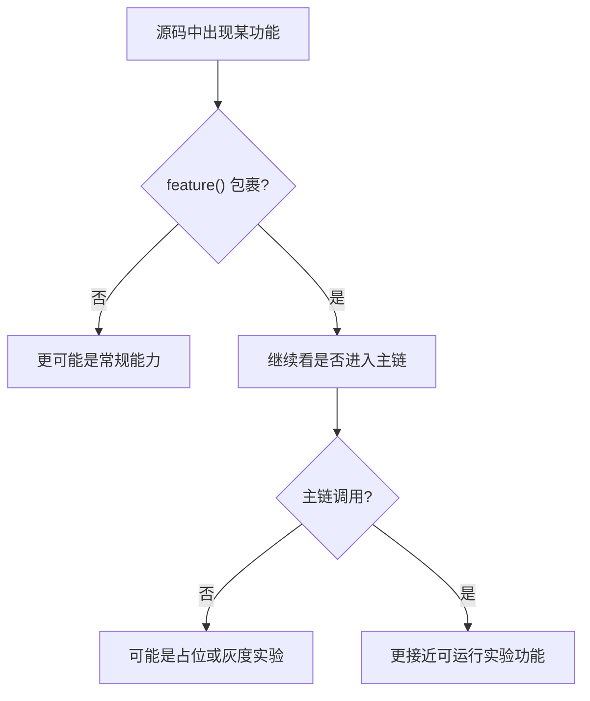
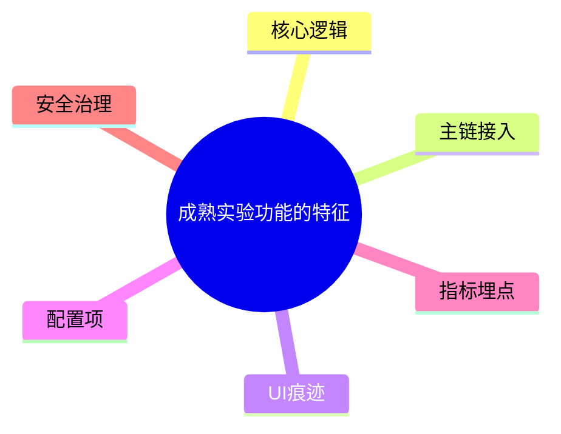
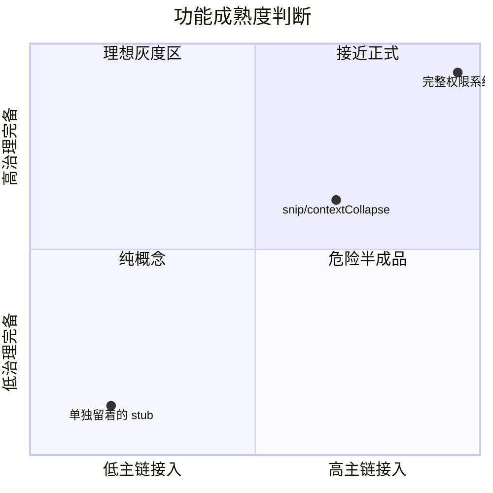
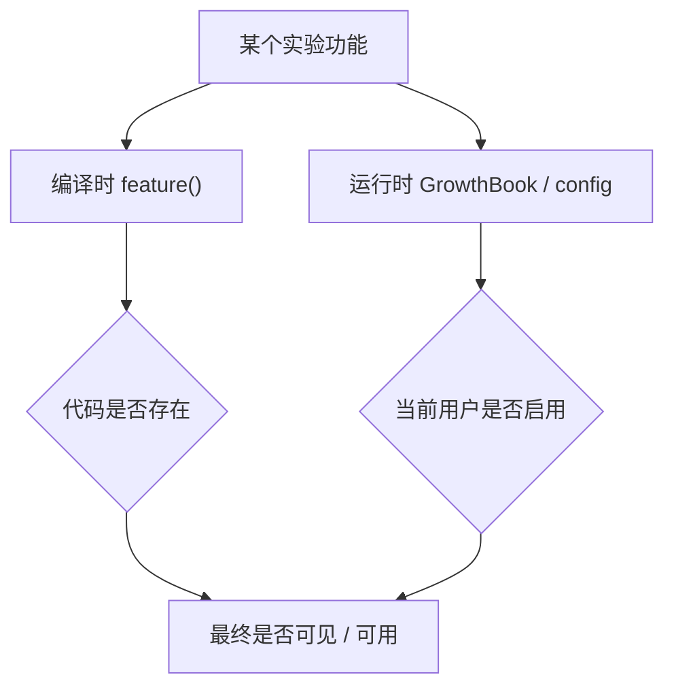
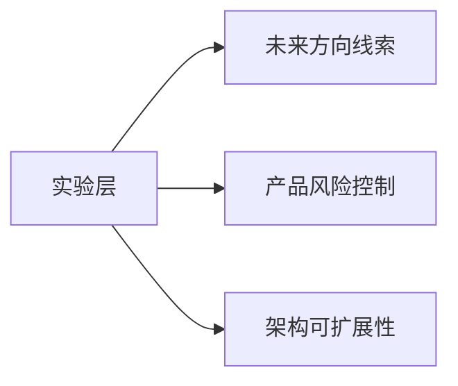

---
tags:
  - Experimental
  - 第七编
---

# 第32章：实验区：哪些功能还在试验

!!! tip "生活类比：车展上的概念车"
    车展上有些车下个月就量产，有些只是展示未来方向。源码里的实验功能也一样：存在，不代表已经是成熟产品。

!!! question "这一章先回答一个问题"
    当你在 Claude Code 源码里看到 `contextCollapse`、`snip`、`KAIROS`、隐藏命令、feature gate 时，怎么判断它们是正式功能、灰度功能，还是仅仅为将来留的位置？

真正的答案不是“看目录里有没有”，而是看三件事：**是否被 feature gate 包裹、是否接进主调用链、是否有完整治理路径。**

---

## 32.1 第一个判断标准：有没有被 `feature()` 包起来

在 Claude Code 里，很多实验代码不会直接静态常驻，而是通过 `feature('FLAG')` 有条件加载。最典型的例子就在 `QueryEngine.ts`：

- `HISTORY_SNIP`
- `COORDINATOR_MODE`
- `KAIROS`

这也是为什么“看到了代码”不等于“用户一定能用到”。很多路径会在构建时被 DCE 直接裁掉。

---

## 32.2 第二个判断标准：是否真的接进主执行链

一个实验功能如果只是孤零零躺在目录里，价值不大。真正值得关注的，是它有没有进入：

- QueryEngine
- REPL
- tools.ts
- commands.ts
- settings / config

例如 `contextCollapse`、`snipCompactIfNeeded()`、`getCoordinatorUserContext()` 这些，都已经在主链上占到了位置。

如果一段代码既有 gate，又有主链接入，那它通常不是“随手放着玩的”。

---

## 32.3 第三个判断标准：有没有完整的配套治理

很多真正要上线的实验功能，不会只有一段核心逻辑，还会伴随：

- 配套设置项
- 提示词或系统上下文
- 权限规则
- UI 入口
- 日志与指标

例如 `KAIROS` 不只出现在一个目录里，还能在 `tools.ts`、`main.tsx`、`REPL.tsx`、analytics metadata、BriefTool 等多个位置看到痕迹。

如果只看到一段核心逻辑，没有配套治理，那它更像概念验证。

---

## 32.4 `contextCollapse` 和 `snip` 为什么最值得放进“实验区”讲

这两类能力特别适合作为“如何识别实验层”的教材，因为它们恰好卡在正式能力和探索能力之间：

- 已经和主循环挂上了
- 但仍受门控控制
- 功能目标明确
- 语义稳定性仍在打磨

这也说明读源码时不能只问“有没有”，还要问“成熟到什么程度”。

---

## 32.5 GrowthBook 和 feature gate 一起，形成了实验层的双门控

Claude Code 的实验能力，不完全只靠编译时 gate。还有一部分会进入 `GrowthBook` 这类远程配置体系。

所以实验功能的真实状态，可能要同时看：

- 构建时是否被编进来
- 运行时是否被组织、账号、环境、实验分组打开

这也是为什么“我在仓库里看到了，但机器上没出现”经常是正常现象。

---

## 32.6 设计取舍：实验层不是脏东西，而是产品演化现场

很多人读源码会下意识嫌弃实验代码，觉得“这不纯”。其实对大型产品来说，实验层恰好是最有信息密度的地方，因为它暴露了：

- 团队正在试什么
- 哪些方向还没定型
- 哪些功能被谨慎推进
- 哪些只适合特定用户群

对这本书来说，实验区不是边角料，反而是理解 Claude Code 演化方向的重要窗口。

!!! abstract "🔭 深水区（架构师选读）"
    判断实验层最实用的方法可以记成一句话：看 gate，看主链，看治理。三者都在，说明它是认真推进中的实验；只有一两个角落提到，多半还只是方向探索；如果再叠加 shim/stub，就要格外小心，不要把补全层误当成正式设计。

!!! success "本章小结"
    `feature()`、主链接入程度、治理配套程度，是判断一段代码成熟度的三把尺子。实验功能不是杂质，而是产品未来方向最直接的证据。

!!! info "关键源码索引"
    - QueryEngine 条件导入 snip / coordinator：[QueryEngine.ts](/Users/champion/Documents/develop/Warwolf/OpenClaudeCode/src/QueryEngine.ts#L110)
    - QueryEngine 条件导入 memory/snip：[QueryEngine.ts](/Users/champion/Documents/develop/Warwolf/OpenClaudeCode/src/QueryEngine.ts#L120)
    - Query 主循环中的 snip / collapse：[query.ts](/Users/champion/Documents/develop/Warwolf/OpenClaudeCode/src/query.ts#L403)
    - 工具池中的 feature gate 痕迹：[tools.ts](/Users/champion/Documents/develop/Warwolf/claude-code-sourcemap/restored-src/src/tools.ts#L26)
    - GrowthBook 功能读取：[growthbook.ts](/Users/champion/Documents/develop/Warwolf/OpenClaudeCode/src/services/analytics/growthbook.ts#L734)
    - cached + refresh 路径：[growthbook.ts](/Users/champion/Documents/develop/Warwolf/OpenClaudeCode/src/services/analytics/growthbook.ts#L783)

!!! warning "逆向提醒"
    实验功能是最容易被误读的区域。因为你同时会在还原层、OpenClaudeCode 补全层、feature gate、GrowthBook、隐藏入口里看到它的碎片。结论一定要基于多处证据交叉，而不是只看一个目录或一个函数名。
