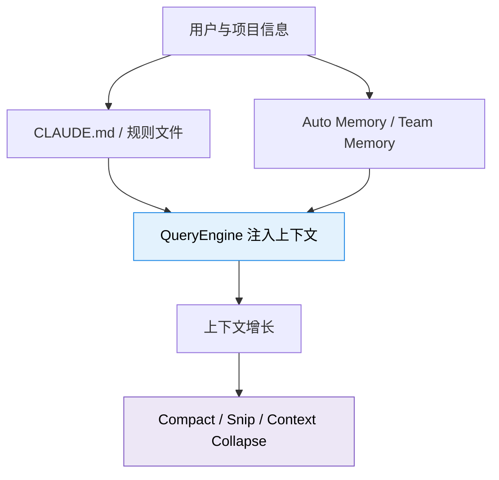

# 第七编：记忆与遗忘

> *一个好助手，不只是“现在听得懂你”，还要“过几天还能接上你的上下文”。*
>
> Claude Code 的记忆系统不是一个大缓存，而是多层结构：**会话内上下文**、**项目级指令**、**持久化记忆目录**、**团队共享记忆**，再加上一整套压缩和实验机制来控制体积与新鲜度。

---

## 本编总览

---

## 本编四章速览

| 章 | 标题 | 核心问题 | 生活类比 |
|---|---|---|---|
| 29 | [四层记忆](chapter29.md) | 关掉终端之后，Claude Code 还记得什么？ | 人的记忆分层 |
| 30 | [AI 的笔记本](chapter30.md) | CLAUDE.md、MEMORY.md、DreamTask 各自负责什么？ | 教科书、笔记本、错题集 |
| 31 | [压缩系统](chapter31.md) | 上下文快满了，怎么瘦身又不丢重点？ | 塞满的行李箱 |
| 32 | [实验区](chapter32.md) | 哪些代码已经上线，哪些还只是概念车？ | 车展上的概念车 |

---

## 你会在这一编看到什么

!!! success "本编阅读目标"
    读完这一编，你会明白 Claude Code 的“记忆”不是魔法，而是一套文件化、可注入、可压缩、可同步、也会过期的工程系统。
