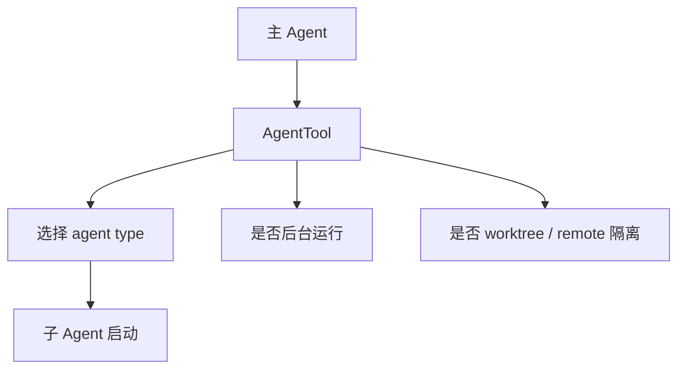
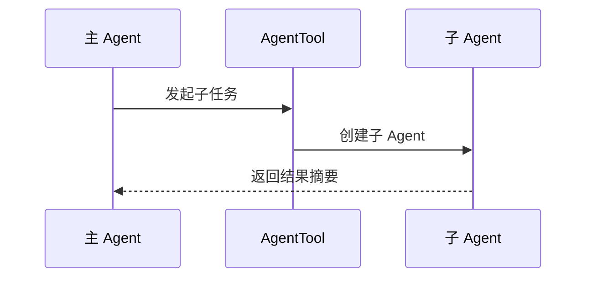
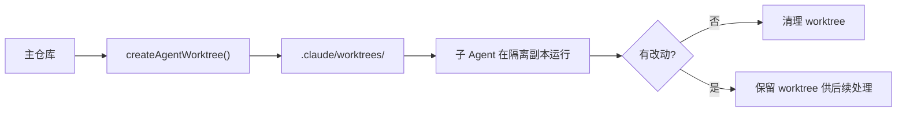
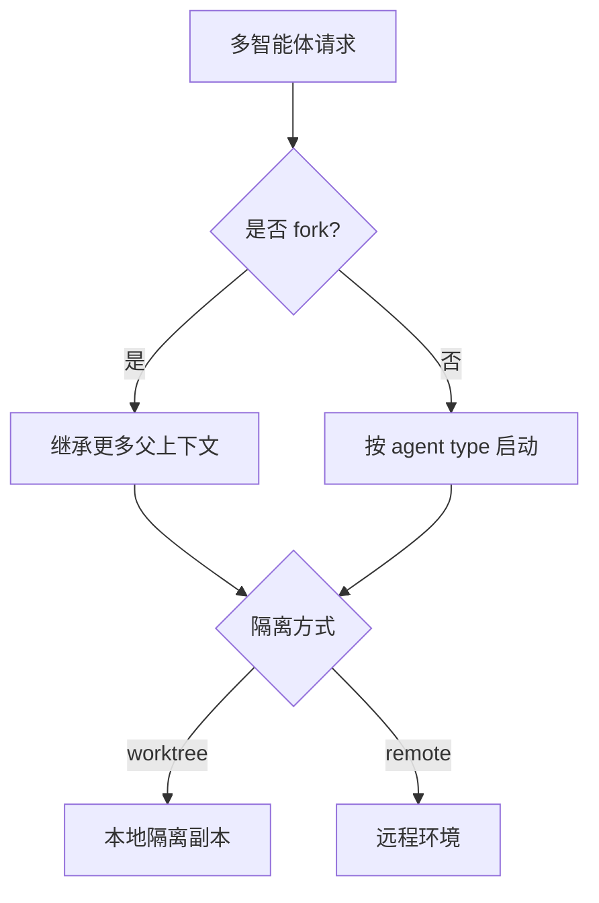
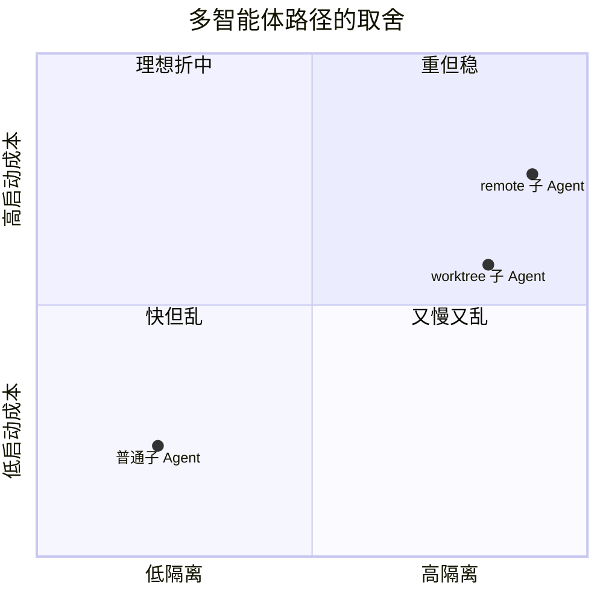

---
tags:
  - Multi-Agent
  - 第八编
---

# 第33章：为什么一个 AI 不够用

!!! tip "生活类比：搬家公司"
    一个人搬家可以慢慢来，但遇到打包、拆装、运输、清点同时发生时，分工协作会快得多。Claude Code 的多智能体体系，也是为了把复杂任务拆成可以并行推进的工作单元。

!!! question "这一章先回答一个问题"
    Claude Code 为什么不坚持“一个 Agent 干到底”，而要引入子 Agent、worktree 隔离、远程隔离这些更复杂的路径？

因为复杂任务有三个痛点：**上下文会被塞爆、不同子任务会互相干扰、串行执行太慢**。多智能体就是对这三个问题的系统性回答。

---

## 33.1 AgentTool：多智能体的大门

`AgentTool.tsx` 不是一个小插件，而是整套多智能体体系的入口。它的 schema 已经直接暴露出几个关键概念：

- `subagent_type`
- `run_in_background`
- `isolation`

从这个 schema 就能看出来：Claude Code 把“派一个子 Agent 去做事”当成了一等公民能力。

---

## 33.2 第一条路径：普通子 Agent，最快但共享风险也最多

最基础的情况是直接派生子 Agent，让它继承一部分任务描述和工具能力去执行。它适合：

- 搜索与调研
- 独立分析
- 一次性验证

这条路径的优点是启动快，缺点是如果任务涉及文件改动，互相踩到上下文和工作区的风险会更高。

---

## 33.3 第二条路径：worktree 隔离，让子 Agent 真正拥有独立工位

Claude Code 很认真地对待“同时改代码”这件事，所以 `AgentTool.tsx` 会和 `utils/worktree.ts` 配合，支持 `isolation: "worktree"`。

这条路径做的事情包括：

- 创建或恢复独立 git worktree
- 复用仓库结构
- 允许子 Agent 在隔离副本里工作
- 完成后根据变更决定保留还是清理

这很像给每个子 Agent 发了一张独立工位和独立草稿纸。

---

## 33.4 第三条路径：fork / remote，把上下文继承和环境隔离都做成可选

`forkSubagent.ts` 展示了另一条路线：当实验门控打开时，省略 `subagent_type` 可以走隐式 fork，让子 Agent 继承更完整的上下文。

再加上 `loadAgentsDir.ts` 对 `isolation` 的定义，Claude Code 实际上允许两种隔离思路：

- `worktree`
- `remote`

这说明 Claude Code 并没有把多智能体固化成一种模式，而是在做“上下文继承程度”和“执行环境隔离程度”的组合设计。

---

## 33.5 设计取舍：为什么多智能体一定要配隔离

如果只是“多开几个 Agent”，却让它们都在同一个工作区里随便写，那收益会很快被混乱吞掉。

Claude Code 的多智能体设计非常现实：它承认协作越强，越要先解决隔离。

!!! abstract "🔭 深水区（架构师选读）"
    这一章最重要的不是记住三个名字，而是理解两个设计轴：上下文继承程度、执行环境隔离程度。Claude Code 的多智能体不是“多模型并发”这么简单，而是在这两条轴上组合出多种协作形态。

!!! success "本章小结"
    多智能体存在的理由，是为了让复杂任务可以拆、可以并行、可以隔离。AgentTool、fork、worktree 和 remote 共同构成了 Claude Code 的三条组队路径。

!!! info "关键源码索引"
    - AgentTool 输入 schema：[AgentTool.tsx](/Users/champion/Documents/develop/Warwolf/OpenClaudeCode/src/tools/AgentTool/AgentTool.tsx#L85)
    - 隔离模式定义：[AgentTool.tsx](/Users/champion/Documents/develop/Warwolf/OpenClaudeCode/src/tools/AgentTool/AgentTool.tsx#L99)
    - worktree 创建与清理：[AgentTool.tsx](/Users/champion/Documents/develop/Warwolf/OpenClaudeCode/src/tools/AgentTool/AgentTool.tsx#L590)
    - fork subagent 实验说明：[forkSubagent.ts](/Users/champion/Documents/develop/Warwolf/OpenClaudeCode/src/tools/AgentTool/forkSubagent.ts#L19)
    - fork + worktree notice：[forkSubagent.ts](/Users/champion/Documents/develop/Warwolf/OpenClaudeCode/src/tools/AgentTool/forkSubagent.ts#L201)
    - agent isolation frontmatter：[loadAgentsDir.ts](/Users/champion/Documents/develop/Warwolf/OpenClaudeCode/src/tools/AgentTool/loadAgentsDir.ts#L94)
    - worktree 实现：[worktree.ts](/Users/champion/Documents/develop/Warwolf/OpenClaudeCode/src/utils/worktree.ts#L230)

!!! warning "逆向提醒"
    多智能体代码里既有正式能力，也混入了 feature gate 与 ant-only 路径。尤其 `remote` 和部分 fork 行为，要区分“接口已存在”与“默认环境里一定可用”。
