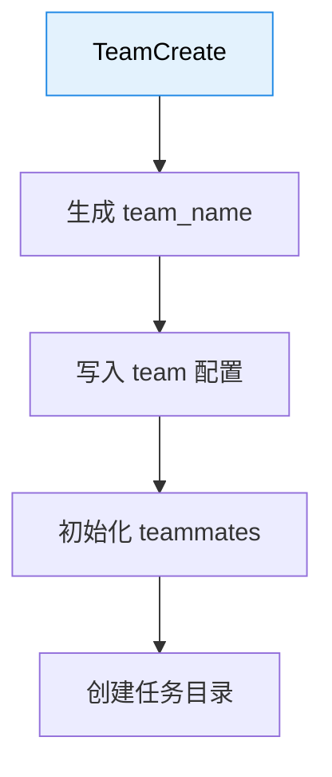
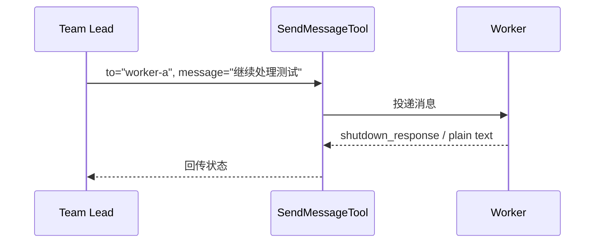
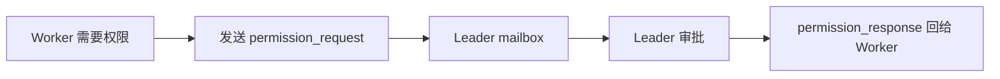
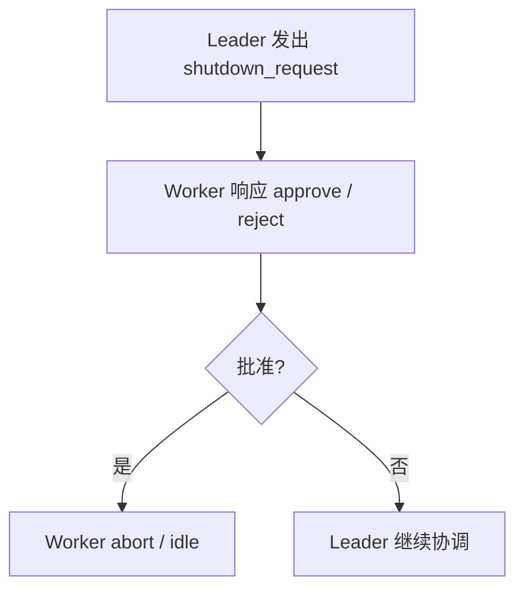
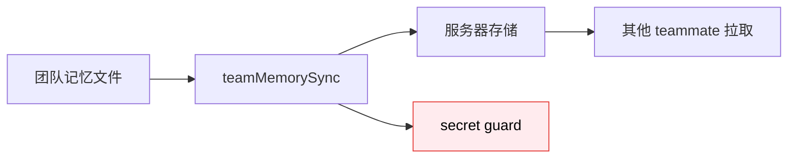

---
tags:
  - Swarm
  - 第八编
---

# 第34章：团队蜂群：AI 组队的架构

!!! tip "生活类比：蜜蜂分工"
    蜜蜂不是一窝蜂乱飞。侦察蜂找方向，工蜂搬运，守卫蜂维持秩序。Claude Code 的团队模式也一样，重点不是“多几个 Agent”，而是“多几个 Agent 之后如何协作”。

!!! question "这一章先回答一个问题"
    多个 Agent 怎样像真正团队一样创建、沟通、同步状态、优雅结束，而不是各干各的、最后一地鸡毛？

Claude Code 的回答是：**TeamCreate 负责建队，SendMessage 负责沟通，team helpers 与 mailbox 负责维持秩序。**

---

## 34.1 TeamCreate：先把“团队”变成正式对象

`TeamCreateTool.ts` 会显式要求 `team_name`，并在内部创建团队上下文、成员信息和任务目录。这说明“团队”在 Claude Code 里不是隐喻，而是一个真正存在的数据结构。

这一步很重要，因为只有先有“团队对象”，后面的权限同步、消息投递、空闲状态更新才有依托。

---

## 34.2 SendMessage：团队协作靠的不是猜，而是显式通信

`SendMessageTool` 的 prompt 直接强调：普通文本不会自动被别的 Agent 看见，要沟通就必须调用这个工具。

它支持：

- 定向发给某个 teammate
- `*` 广播
- 结构化消息，如 `shutdown_request`

这让团队协作变成显式协议，而不是“大家共享心电感应”。

---

## 34.3 mailbox 与 permission sync：团队协作最难的是“谁替谁拿权限”

多 Agent 协作时，很容易遇到一种现实问题：工作 Agent 自己没权限，但它的负责人有权限。源码里的 `permissionSync.ts` 就是在解决这类问题。

这一步很妙，因为它把团队中的“审批链”也做进了系统，而不是要求所有 Agent 都拥有同样权限。

---

## 34.4 团队不只要能开始，还要能优雅结束

`SendMessageTool` 里能看到 `shutdown_request` / `shutdown_response`，`teammateInit.ts` 还会注册 Stop hook 通知 leader。说明团队结束不是“进程直接杀掉”，而是有协议化关机流程。

这很像真实团队里的“收尾确认”：确保每个人知道任务是否已完成、会话是否可以结束。

---

## 34.5 team memory sync：团队共识也要跟着团队一起流动

多智能体团队如果没有共享记忆，很快就会出现“每个人各记各的版本”。`teamMemorySync/index.ts` 负责把 repo-scoped 的 team memory 同步起来，并且还加了 secret guard。

这说明 Claude Code 眼里的“团队”，不只是会互发消息，还包括共享记忆和共享规则。

---

## 34.6 设计取舍：为什么团队协作一定要协议化

如果多人协作没有清晰协议，问题会迅速冒出来：

- 谁该响应谁
- 谁能广播
- 谁负责审批
- 谁决定关机
- 谁维护团队状态

Claude Code 选择把这些都写成结构化工具和消息协议，而不是留给 prompt 自由发挥。

!!! abstract "🔭 深水区（架构师选读）"
    TeamCreate + SendMessage + mailbox + permission sync 这一套设计说明，Claude Code 的多智能体不是“多线程聊天”，而是在认真构建一个带协议的团队运行时。真正复杂的不是派出 worker，而是让 worker 和 lead 在权限、状态和消息上维持一致。

!!! success "本章小结"
    团队模式的关键，不是多几个 Agent，而是团队对象、消息协议、权限同步、优雅关机和共享记忆这几件事一起成立。Claude Code 在这些方面都做了明确设计。

!!! info "关键源码索引"
    - TeamCreate schema 与入口：[TeamCreateTool.ts](/Users/champion/Documents/develop/Warwolf/OpenClaudeCode/src/tools/TeamCreateTool/TeamCreateTool.ts#L39)
    - TeamCreate 工具定义：[TeamCreateTool.ts](/Users/champion/Documents/develop/Warwolf/OpenClaudeCode/src/tools/TeamCreateTool/TeamCreateTool.ts#L74)
    - TeamCreate 写入 teammates：[TeamCreateTool.ts](/Users/champion/Documents/develop/Warwolf/OpenClaudeCode/src/tools/TeamCreateTool/TeamCreateTool.ts#L200)
    - SendMessage 广播与结构化消息提示：[prompt.ts](/Users/champion/Documents/develop/Warwolf/OpenClaudeCode/src/tools/SendMessageTool/prompt.ts#L34)
    - SendMessage 结构化消息类型：[SendMessageTool.ts](/Users/champion/Documents/develop/Warwolf/OpenClaudeCode/src/tools/SendMessageTool/SendMessageTool.ts#L49)
    - 广播与 shutdown 处理：[SendMessageTool.ts](/Users/champion/Documents/develop/Warwolf/OpenClaudeCode/src/tools/SendMessageTool/SendMessageTool.ts#L214)
    - permission sync 协议说明：[permissionSync.ts](/Users/champion/Documents/develop/Warwolf/OpenClaudeCode/src/utils/swarm/permissionSync.ts#L9)
    - team memory sync：[index.ts](/Users/champion/Documents/develop/Warwolf/OpenClaudeCode/src/services/teamMemorySync/index.ts#L760)

!!! warning "逆向提醒"
    团队协作涉及 tmux、mailbox、hook、远程模式等多条路径。不同环境里实际走的后端不一定完全一样，但消息协议和状态管理思路在源码里是清楚的。
