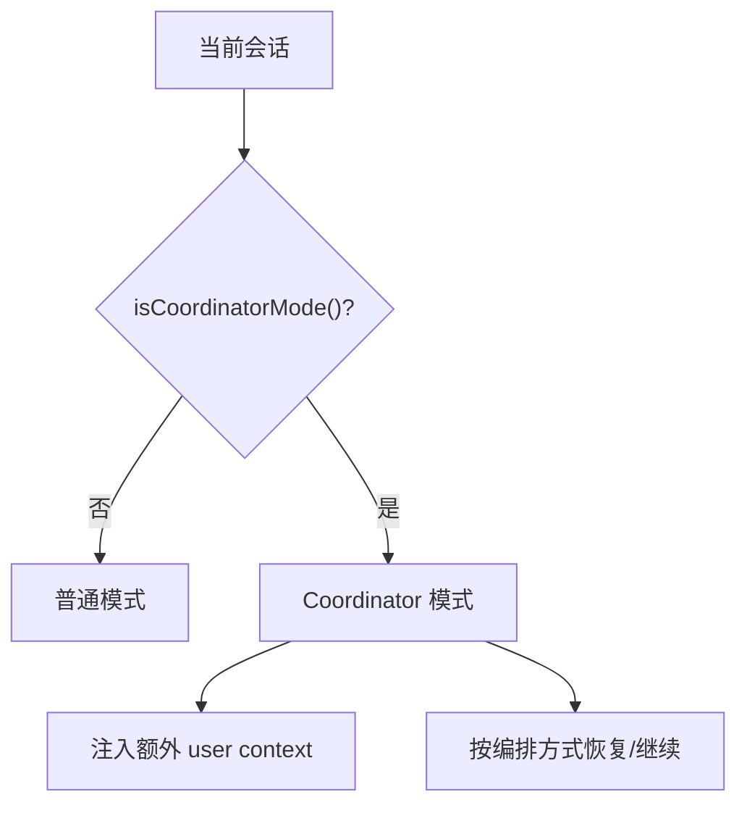
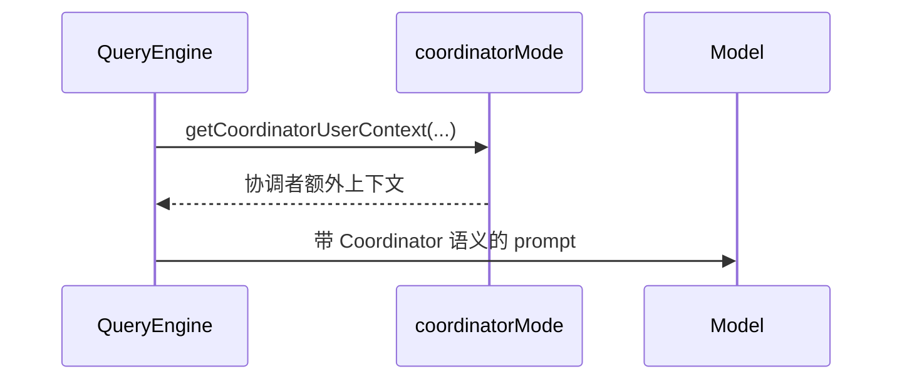
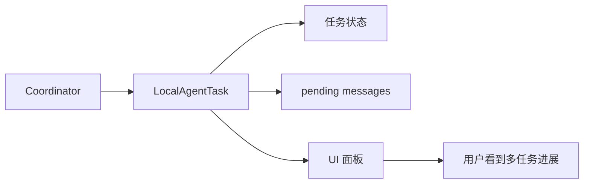
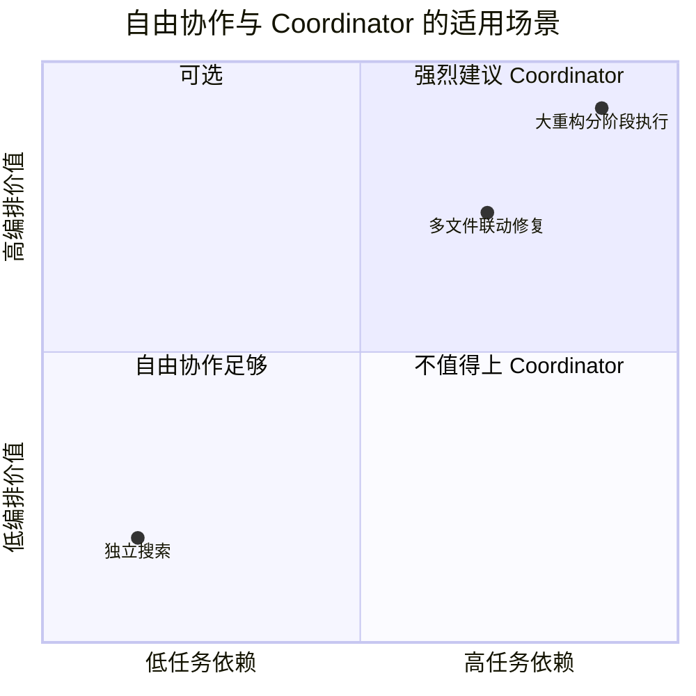

---
tags:
  - Coordinator
  - 第八编
---

# 第35章：指挥官模式：编排引擎

!!! tip "生活类比：乐队指挥"
    指挥不拉小提琴、不吹长笛，但他决定谁先入场、谁做主旋律、什么时候收尾。Coordinator 在多智能体系统里的角色，也很像这样。

!!! question "这一章先回答一个问题"
    当任务之间存在依赖关系时，为什么自由协作不够，还要引入 Coordinator 这种更重的编排模式？

因为一旦任务之间有前后依赖、资源冲突、顺序要求，单纯“大家各干各的”就会让全局最优变成局部最忙。Coordinator 解决的是**顺序与全局视角**。

---

## 35.1 Coordinator 模式首先是一种“会话模式”

`coordinatorMode.ts` 里有非常清晰的模式判断：

- `isCoordinatorMode()`
- `matchSessionMode()`
- `getCoordinatorUserContext()`

也就是说，Coordinator 不是某个散落工具，而是整个会话运行方式的一种切换。

这是非常重要的信号：编排不是临时附加动作，而是主循环本身要知道的上下文。

---

## 35.2 QueryEngine 也要知道“我现在是不是指挥官”

`QueryEngine.ts` 通过 `getCoordinatorUserContext()` 把协调者视角的上下文拼进来。换句话说，Coordinator 并不是只在 UI 层显示个标签，它会影响真正送进模型的上下文。

这说明 Coordinator 的本质，是让模型以“调度者”而不是“单个执行者”的身份思考。

---

## 35.3 LocalAgentTask：编排模式还需要一个可视化任务面板

`LocalAgentTask.tsx` 负责的，正是 Coordinator 模式下本地 agent task 的状态管理。源码里可以看到：

- 后台 agent 执行
- pending messages
- task state 更新
- panel 选择逻辑

这让 Coordinator 不只是“模型脑中的调度者”，还变成了用户可观察的任务编排界面。

---

## 35.4 指挥官模式擅长什么，不擅长什么

Coordinator 特别适合：

- 有依赖关系的多任务
- 需要统一收口的执行流
- 需要全局进度视角的长任务

不那么适合：

- 超短小的独立搜索
- 完全无依赖的小任务

这就是“不是所有多人协作都需要指挥官”的意思。

---

## 35.5 设计取舍：Coordinator 的真正成本，是更强的系统自我意识

一旦系统进入编排模式，它就要额外维护：

- 会话模式一致性
- 恢复时模式匹配
- 子任务状态面板
- 多 agent 的消息与任务同步

所以它更强，但也更重。

!!! abstract "🔭 深水区（架构师选读）"
    Coordinator 最值得学的地方，是把“系统角色”显式化。普通 Agent 是执行者，Coordinator 是编排者。只要角色不同，系统提示、状态管理、恢复逻辑和 UI 面板都要一起变。很多多智能体系统只改 prompt，不改运行时，结果就会半吊子。

!!! success "本章小结"
    Coordinator 模式不是多开几个 Agent，而是让整场会话切换成“指挥官视角”。它适合高依赖、高复杂度任务，也因此需要更完整的状态、恢复和 UI 支撑。

!!! info "关键源码索引"
    - QueryEngine 条件导入 Coordinator：[QueryEngine.ts](/Users/champion/Documents/develop/Warwolf/OpenClaudeCode/src/QueryEngine.ts#L112)
    - QueryEngine 注入 Coordinator user context：[QueryEngine.ts](/Users/champion/Documents/develop/Warwolf/OpenClaudeCode/src/QueryEngine.ts#L304)
    - 判断 Coordinator 模式：[coordinatorMode.ts](/Users/champion/Documents/develop/Warwolf/OpenClaudeCode/src/coordinator/coordinatorMode.ts#L36)
    - 匹配恢复会话模式：[coordinatorMode.ts](/Users/champion/Documents/develop/Warwolf/OpenClaudeCode/src/coordinator/coordinatorMode.ts#L49)
    - Coordinator user context：[coordinatorMode.ts](/Users/champion/Documents/develop/Warwolf/OpenClaudeCode/src/coordinator/coordinatorMode.ts#L80)
    - LocalAgentTask 状态类型：[LocalAgentTask.tsx](/Users/champion/Documents/develop/Warwolf/OpenClaudeCode/src/tasks/LocalAgentTask/LocalAgentTask.tsx#L116)
    - LocalAgentTask 主体：[LocalAgentTask.tsx](/Users/champion/Documents/develop/Warwolf/OpenClaudeCode/src/tasks/LocalAgentTask/LocalAgentTask.tsx#L265)

!!! warning "逆向提醒"
    Coordinator 代码在 OpenClaudeCode 中能看到完整骨架，但任务依赖图和更高层策略细节并不都显式暴露。读到这里时，要区分“运行时支撑已在”与“最终产品策略已完全公开”。
