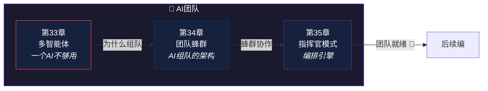

# 第八编：AI团队

> *蜜蜂的分工协作：侦察蜂找花、采蜜蜂干活、守卫蜂负责安全。AI 团队也有类似的角色分工。*
>
> 本编解析 Claude Code 的多智能体协作机制：**三种组队路径**、**团队蜂群架构**、**指挥官编排模式**。

---

## 本编总览

---

## 本编三章速览

| 章 | 标题 | 核心问题 | 生活类比 |
|---|------|----------|----------|
| 33 | [多智能体](chapter33.md) | 子进程、Worktree、Coordinator——三种组队有什么区别？ | 一个人搬家 vs 搬家公司 |
| 34 | [团队蜂群](chapter34.md) | AI 也能组团队？"团队"到底意味着什么？ | 蜜蜂的分工协作 |
| 35 | [指挥官模式](chapter35.md) | 什么时候需要"指挥官"而不是"自由协作"？ | 乐队指挥 |

---

## 设计思想主线

!!! tip "本编建立的认知基础"
    1. 三种组队路径（子进程/Worktree/Coordinator）各有取舍——**没有银弹**
    2. TeamCreate 实现了完整的团队生命周期——**创建、分工、协作、解散**
    3. 扁平协作适合独立任务，复杂依赖需要**指挥官编排**
    4. 多智能体是 AI Agent 框架的**前沿演进方向**

---

## 推荐路径

=== "🌱 初学者"

    第33章从"为什么一个 AI 不够用"开始——**直觉理解多智能体的动机**。

=== "🔧 开发者"

    第34章的 TeamCreate 系统是**实现多智能体协作的完整参考**。

=== "🏗️ 架构师"

    第35章的 Coordinator 模式展示了**复杂任务编排的架构设计**——扁平 vs 层级的取舍。

!!! note "即将上线"
    本编内容正在写作中，敬请期待。
