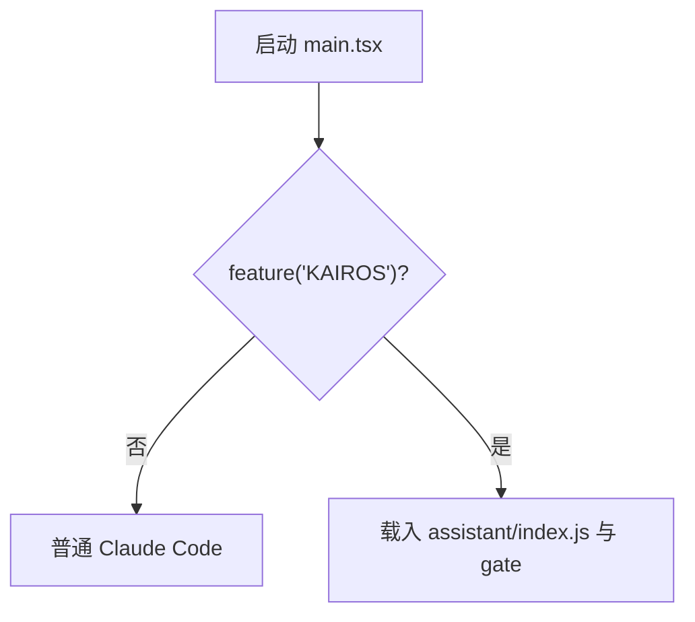
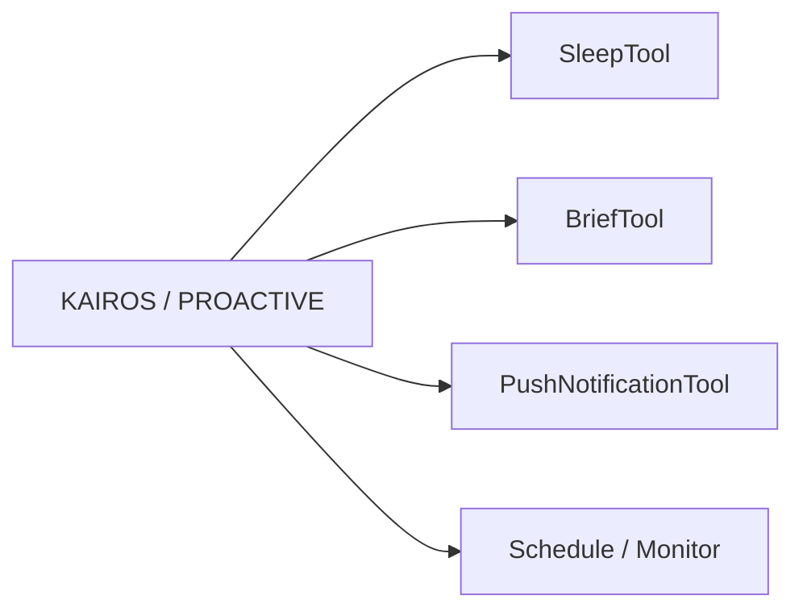
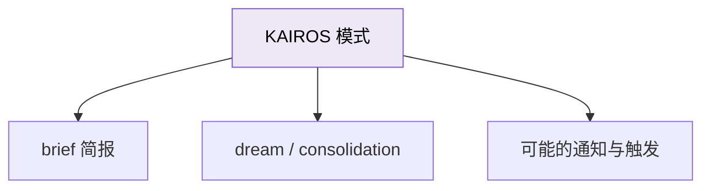
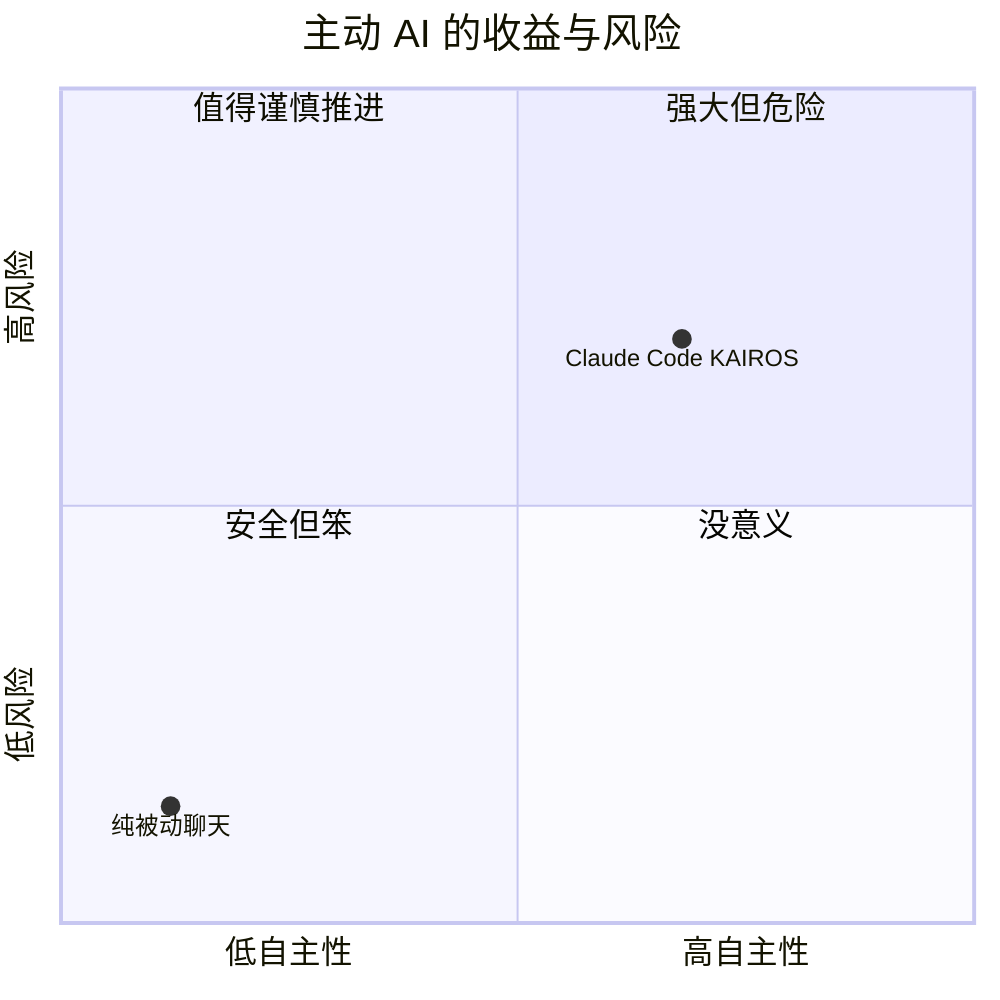

---
tags:
  - KAIROS
  - 第九编
---

# 第36章：KAIROS：AI 学会主动思考

!!! tip "生活类比：从被动实习生到主动同事"
    被动型助手会一直等你发话，主动型同事会在合适的时候自己发现问题、整理线索、推进事情。KAIROS 代表的，就是这种从“响应式 AI”走向“主动式 AI”的尝试。

!!! question "这一章先回答一个问题"
    如果 AI 不只是等你说一句做一步，而是能自己安排后台动作、主动整理记忆、主动给简报，你会更高效，还是更没安全感？

Claude Code 显然已经在探索这个方向，因为 KAIROS 的痕迹不是一两个变量，而是横跨 `main.tsx`、`tools.ts`、Brief、autoDream、BashTool、REPL 的系统级实验。

---

## 36.1 KAIROS 不是单点功能，而是一种模式切换

在 `main.tsx` 里，`assistantModule` 和 `kairosGate` 是以条件导入的方式出现的。这说明 KAIROS 不是普通小工具，而是一个足以影响启动路径和会话模式的能力。

这件事非常关键，因为它说明 KAIROS 不是“聊天时偶尔多说一句”，而是会改变运行时结构的能力。

---

## 36.2 KAIROS 最直观的特征：它开始把后台任务纳入核心体验

从 `tools.ts` 可以看到，只要 `feature('PROACTIVE') || feature('KAIROS')` 成立，一系列工具就会被带进来：

- SleepTool
- BriefTool 相关
- Push Notification 相关
- Trigger / Monitor 相关能力

这说明 KAIROS 的目标不是“换个名字的聊天模式”，而是让 Claude Code 具备更持续、更异步、更后台化的行为模式。

---

## 36.3 autoDream 和 Brief，都是“主动整理”的侧面证据

`autoDream.ts` 里有一句很有意思的话：`if (getKairosActive()) return false // KAIROS mode uses disk-skill dream`。这说明 KAIROS 会影响记忆整理路径。

同时 `/brief` 命令和 `BriefTool` 也受 `KAIROS` 或 `KAIROS_BRIEF` 控制。

从产品视角看，这些都指向同一件事：**AI 不再只在前台回答，而开始在后台维持连续性。**

---

## 36.4 KAIROS 为什么危险，也为什么迷人

主动 AI 最大的好处，是帮你减少显式指挥成本；最大的风险，是它开始拥有“时机判断权”。

这也是为什么 KAIROS 一直被 gate、brief entitlement、autoDream 分流等多种机制包着。它显然很有潜力，但也显然不能轻率全量放开。

---

## 36.5 设计取舍：从“命令式助手”到“主动代理”的分水岭

KAIROS 最值得我们注意的，不是它现在成熟了多少，而是它定义了 Claude Code 想去的方向：

- 更持续的后台运行
- 更主动的任务整理
- 更少“你每一步都得明说”

!!! abstract "🔭 深水区（架构师选读）"
    KAIROS 代表的是交互范式升级：从“prompt 驱动”走向“时机驱动”。一旦系统开始判断何时行动，它就不再只是工具，而更像一个长期在线的代理。这会把权限、安全、记忆、通知、后台执行全都重新拉到一个更高难度层级上。

!!! success "本章小结"
    KAIROS 不是单个隐藏功能，而是 Claude Code 朝“主动式 Agent”演进的总代号。它的痕迹贯穿启动、工具、简报、记忆整理和后台行为。

!!! info "关键源码索引"
    - `main.tsx` 中 KAIROS 条件导入：`main.tsx`
    - `tools.ts` 中 KAIROS / PROACTIVE 工具门控：`tools.ts`
    - autoDream 对 KAIROS 的分流：`autoDream.ts`
    - `/brief` 命令门控：`brief.ts`
    - analytics 中的 kairosActive 痕迹：`metadata.ts`

!!! warning "逆向提醒"
    KAIROS 是最容易被过度解读的区域之一。你能确认它是强烈存在的方向，但不能把所有相关门控分支都视为已稳定发布的最终产品能力。
