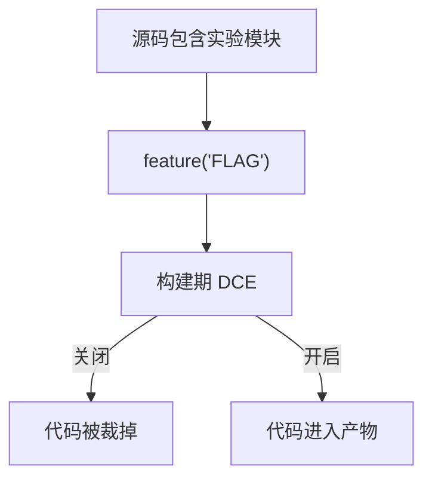
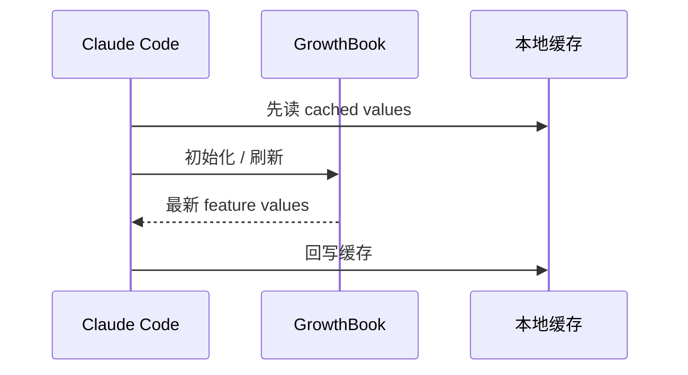
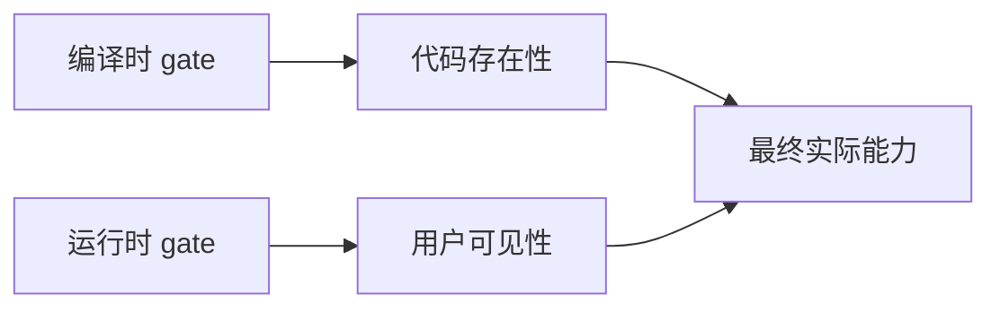
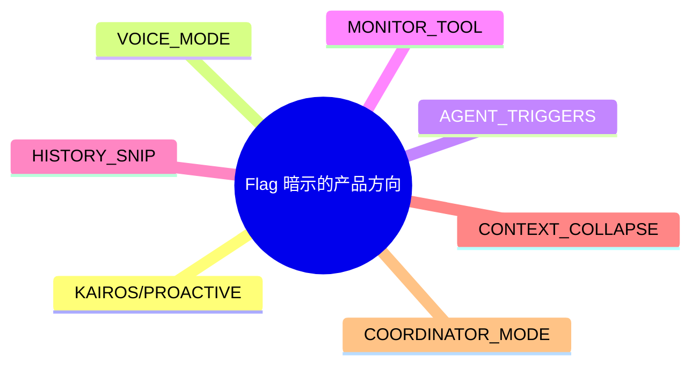
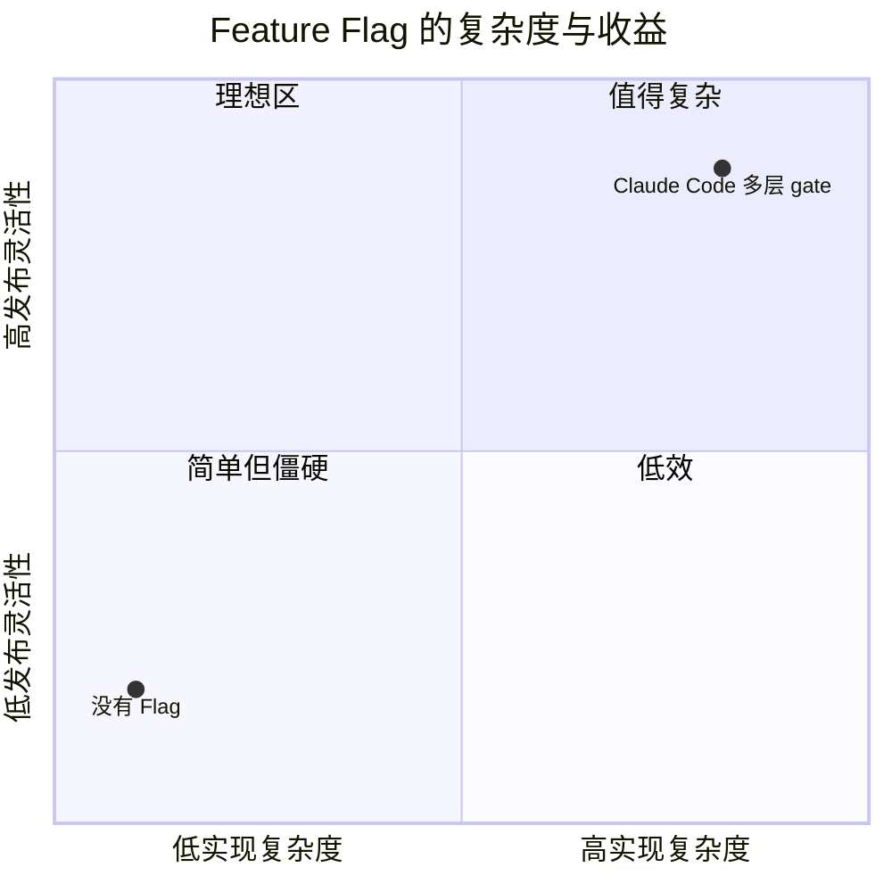

---
tags:
  - Feature Flag
  - 第九编
---

# 第37章：Feature Flag：89 个开关背后的秘密

!!! tip "生活类比：一栋很多房间的大楼"
    有些房间一直开放，有些房间只对特定人开放，有些房间正在装修，还有些房间甚至只在特定时间启用。Feature Flag 就像这栋楼里的开关与门禁系统。

!!! question "这一章先回答一个问题"
    为什么 Claude Code 的源码里到处都是 `feature('XXX')`、GrowthBook 配置和 cached gate？这到底是在增加复杂度，还是在控制复杂度？

答案是后者。对一个快速演化的产品来说，Feature Flag 不是“临时补丁”，而是让试验、灰度、组织策略和构建裁剪可以并存的基础设施。

---

## 37.1 编译时 gate：让某些代码根本不进产物

`feature()` 的一个重要用途，是配合 dead code elimination。像 `tools.ts`、`cli.tsx`、`QueryEngine.ts` 这类入口文件里，很多能力都是条件导入的。

这类 gate 特别适合：

- 构建体积敏感的功能
- 平台差异明显的功能
- 暂时不希望外部构建拿到的功能

---

## 37.2 运行时 gate：GrowthBook 让“同一份代码”服务不同用户

[`growthbook.ts`](/Users/champion/Documents/develop/Warwolf/OpenClaudeCode/src/services/analytics/growthbook.ts#L227) 展示的则是另一层：运行时特性读取。

它支持：

- 读取全部特性值
- 初始化客户端
- cached may be stale
- cached with refresh
- entitlement / security gate

这让 Claude Code 能做到：同一个版本，不同用户、不同组织、不同时间看到的功能并不完全一样。

---

## 37.3 编译时 gate 和运行时 gate 为什么要并存

很多人会问：既然有 GrowthBook，为什么还要 `feature()`？

因为它们解决的问题不同：

| 类型 | 作用 |
|---|---|
| 编译时 gate | 决定代码是否存在于产物中 |
| 运行时 gate | 决定存在的代码是否对当前用户生效 |

只有两层都做，产品才既能瘦身，又能灰度。

---

## 37.4 Flag 的真正价值，是把产品版图写进代码里

你只要扫一遍 `tools.ts`、`ConfigTool`、`REPL`、`main.tsx`，就能感受到 Claude Code 的能力版图远远超过默认界面里能看到的那一点点。

从源码能明显看见几类方向：

- 主动模式与触发系统
- 语音与多模态
- 监控与后台任务
- 多智能体与编排
- 实验性上下文管理

所以 Feature Flag 不是“技术债列表”，反而是产品路线图的侧写。

---

## 37.5 设计取舍：开关很多，会不会让系统更乱

会增加复杂度，但换来的收益也非常大：

- 降低一次性发布风险
- 允许平台差异
- 支持组织级策略
- 让实验不必污染默认体验

对这样一款快速迭代、能力跨度又极大的产品来说，这笔复杂度支出是划算的。

!!! abstract "🔭 深水区（架构师选读）"
    Feature Flag 最成熟的用法，不是“留个 if 将来删”，而是把构建裁剪、灰度分发、组织门禁和 kill switch 统一成一套策略层。Claude Code 的 gate 体系正是在承担这个角色，所以它看起来复杂，但并不随意。

!!! success "本章小结"
    Feature Flag 是 Claude Code 的演化基础设施。编译时 gate 决定代码有没有，运行时 gate 决定谁能用到它们，两者合起来才让试验和发布变得可控。

!!! info "关键源码索引"
    - `tools.ts` 中的多处 gate：[tools.ts](/Users/champion/Documents/develop/Warwolf/OpenClaudeCode/src/tools.ts#L24)
    - `cli.tsx` 的 fast path 与条件分流：[cli.tsx](/Users/champion/Documents/develop/Warwolf/OpenClaudeCode/src/entrypoints/cli.tsx#L30)
    - 全部 GrowthBook features 读取：[growthbook.ts](/Users/champion/Documents/develop/Warwolf/OpenClaudeCode/src/services/analytics/growthbook.ts#L227)
    - GrowthBook 初始化：[growthbook.ts](/Users/champion/Documents/develop/Warwolf/OpenClaudeCode/src/services/analytics/growthbook.ts#L622)
    - `CACHED_MAY_BE_STALE` 读取：[growthbook.ts](/Users/champion/Documents/develop/Warwolf/OpenClaudeCode/src/services/analytics/growthbook.ts#L734)
    - `CACHED_WITH_REFRESH` 读取：[growthbook.ts](/Users/champion/Documents/develop/Warwolf/OpenClaudeCode/src/services/analytics/growthbook.ts#L783)

!!! warning "逆向提醒"
    “89 个开关”是研究过程中得到的能力版图印象，但具体数字会随版本和还原范围变化。比数字更重要的是读懂 gate 的结构和它们暗示的产品方向。
