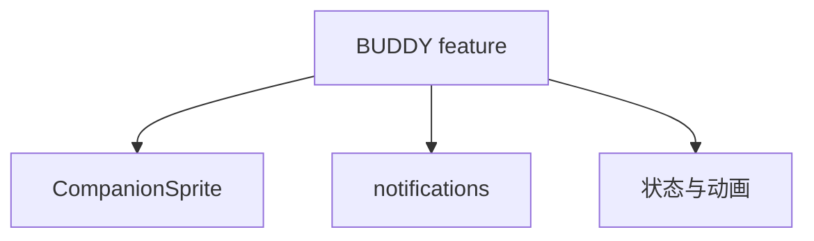
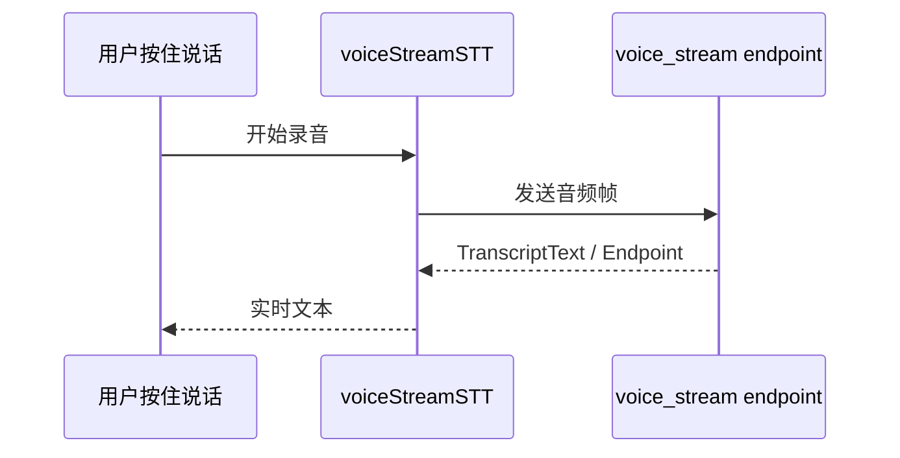
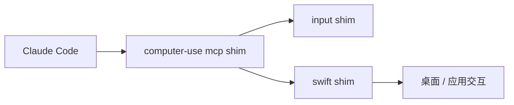
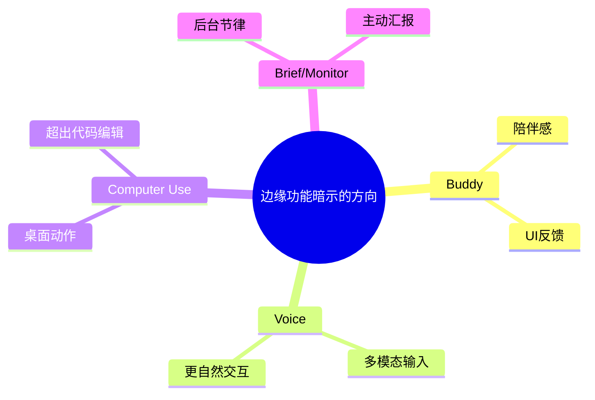

---
tags:
  - Hidden Features
  - 第九编
---

# 第38章：彩蛋与前沿功能：Buddy、Voice 与 Computer Use

!!! tip "生活类比：游戏隐藏关卡"
    好游戏里总会藏一些只有细心玩家才会发现的机关。Claude Code 的源码里，也藏着一些不属于“默认主线”，但很能透露团队思路的功能。

!!! question "这一章先回答一个问题"
    Buddy 小宠物、Voice 语音输入、Computer Use、Brief、Monitor 这些看起来五花八门的能力，究竟只是彩蛋，还是产品未来的试验田？

答案是两者都有。有些更偏趣味与陪伴，有些则是在提前验证未来的人机交互形态。

---

## 38.1 Buddy：一个看似轻松的功能，暴露了终端 UI 的野心

`src/buddy/` 目录里能看到完整的小伙伴体系，包括：

- `CompanionSprite.tsx`
- `companion.ts`
- `sprites.ts`
- `useBuddyNotification.tsx`

这件事看似只是彩蛋，但它说明了 Claude Code 的终端 UI 并不满足于“纯文本壳”，而是愿意探索更具陪伴感和反馈感的界面表达。

---

## 38.2 Voice：说明输入方式正在从键盘扩展出去

`voiceStreamSTT.ts` 非常直白地展示了一个语音流式转写客户端：

- 使用 WebSocket
- 走 OAuth 凭证
- 有 KeepAlive / CloseStream 协议
- 处理 transcript chunk 和 finalize

从设计角度看，这代表 Claude Code 不只在扩展“能做什么”，也在扩展“你怎么和它说话”。

---

## 38.3 Computer Use：从代码世界伸向桌面世界

`shims/ant-computer-use-mcp`、`ant-computer-use-input`、`ant-computer-use-swift` 这些 shim，很明显不是普通代码编辑能力，而是在探索桌面与输入层控制。

这类功能一旦成熟，Claude Code 就不再只是“会改代码的 CLI”，而会开始触碰真实操作环境。

---

## 38.4 Brief / Monitor / Trigger：说明系统正在长出“后台节律”

`BriefTool`、`ScheduleCronTool`、`MonitorTool` 这些 gate 组合起来，很像一个更长期在线的代理系统骨架。

所以这章里真正重要的，不是“发现了多少彩蛋”，而是发现这些彩蛋在往同一个方向汇聚。

---

## 38.5 设计取舍：隐藏功能为什么值得认真看

它们往往更能说明团队的真实探索方向，因为这些能力尚未被市场话术打磨过，反而更原始、更直接。

!!! abstract "🔭 深水区（架构师选读）"
    Buddy、Voice、Computer Use、Brief、Monitor 放在一起看，会得到一个非常清晰的方向图：Claude Code 正在从“文本式编程助手”向“多模态、后台化、主动式代理”试探。这些能力未必都成熟，但方向已经非常明确。

!!! success "本章小结"
    彩蛋不是边角料。Buddy 透露 UI 野心，Voice 透露输入演化，Computer Use 透露能力边界正在扩张，Brief/Monitor 则透露系统正走向更持续的后台代理。

!!! info "关键源码索引"
    - Buddy 组件：[CompanionSprite.tsx](/Users/champion/Documents/develop/Warwolf/OpenClaudeCode/src/buddy/CompanionSprite.tsx#L1)
    - Buddy 目录：[buddy/](/Users/champion/Documents/develop/Warwolf/OpenClaudeCode/src/buddy)
    - Voice 流式 STT：[voiceStreamSTT.ts](/Users/champion/Documents/develop/Warwolf/OpenClaudeCode/src/services/voiceStreamSTT.ts#L1)
    - Voice 模式设置痕迹：[supportedSettings.ts](/Users/champion/Documents/develop/Warwolf/OpenClaudeCode/src/tools/ConfigTool/supportedSettings.ts#L144)
    - Computer Use shim：[index.ts](/Users/champion/Documents/develop/Warwolf/OpenClaudeCode/shims/ant-computer-use-mcp/index.ts#L1)
    - Computer Use 输入 shim：[index.ts](/Users/champion/Documents/develop/Warwolf/OpenClaudeCode/shims/ant-computer-use-input/index.ts#L1)
    - REPL 中 Buddy / Voice 痕迹：[REPL.tsx](/Users/champion/Documents/develop/Warwolf/claude-code-sourcemap/restored-src/src/screens/REPL.tsx#L4022)
    - `BUDDY` 在 REPL 中的分支：[REPL.tsx](/Users/champion/Documents/develop/Warwolf/claude-code-sourcemap/restored-src/src/screens/REPL.tsx#L4565)

!!! warning "逆向提醒"
    这一章覆盖的很多能力都带强烈门控或 shim 色彩。它们是“方向证据”非常有价值，但不能简单等同于“今天默认可用的稳定功能清单”。
