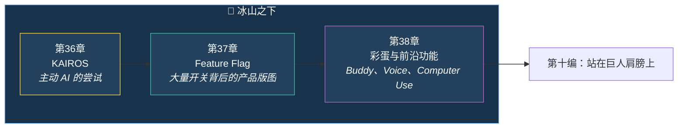

# 第九编：冰山之下

> *很多产品真正透露方向感的，不是首页上写了什么，而是那些藏在 feature gate、实验模块和边缘目录里的代码。*
>
> 这一编专门看 Claude Code 的隐藏层：**KAIROS 主动模式**、**Feature Flag 系统**、**彩蛋与前沿能力**。

---

## 本编总览

---

## 本编三章速览

| 章 | 标题 | 核心问题 | 生活类比 |
|---|---|---|---|
| 36 | [KAIROS](chapter36.md) | AI 能不能从“等你下指令”变成“主动找事做”？ | 从实习生到资深同事 |
| 37 | [Feature Flag](chapter37.md) | 为什么代码里到处都是开关？ | 一栋很多房间的大楼 |
| 38 | [彩蛋与前沿功能](chapter38.md) | Buddy、Voice、Computer Use 说明了什么？ | 游戏隐藏关卡 |

!!! success "本编阅读目标"
    读完这一编，你会知道哪些代码只是彩蛋，哪些代码其实在提前泄露 Claude Code 的未来方向。
