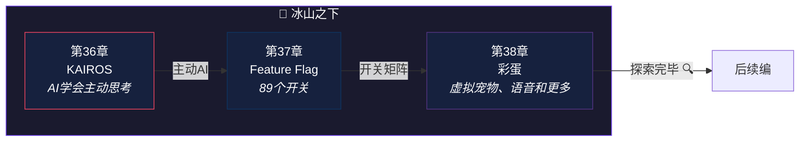

# 第九编：冰山之下

> *游戏里的隐藏关卡——知道秘密通道的人才能进入。Claude Code 也有很多隐藏功能等你发现。*
>
> 本编探索 Claude Code 的隐藏特性和前沿功能：**KAIROS 主动 AI**、**89 个 Feature Flag**、**彩蛋与实验功能**。

---

## 本编总览

---

## 本编三章速览

| 章 | 标题 | 核心问题 | 生活类比 |
|---|------|----------|----------|
| 36 | [KAIROS](chapter36.md) | 如果 AI 不等你说话就主动行动——你愿意吗？ | 从实习生到资深员工 |
| 37 | [Feature Flag](chapter37.md) | 89 个开关背后，Anthropic 到底还在做什么？ | 89个房间的大楼 |
| 38 | [彩蛋](chapter38.md) | 虚拟宠物？语音对话？控制鼠标键盘？ | 游戏隐藏关卡 |

---

## 设计思想主线

!!! tip "本编建立的认知基础"
    1. KAIROS 代表了 AI 交互的范式转变——**从"你说一句、它做一步"到"主动找活干"**
    2. 89 个 Feature Flag 揭示了 Claude Code 的**完整能力版图**——包括你看得见的和看不见的
    3. 彩蛋和实验功能展示了**工程师文化**和**前沿技术孵化**
    4. 冰山之下的代码体量可能超过冰山之上——**隐藏功能是理解产品方向的窗口**

---

## 推荐路径

=== "🌱 初学者"

    第38章的彩蛋最有趣——**发现隐藏功能的乐趣**。第36章的 KAIROS 概念也值得了解。

=== "🔧 开发者"

    第37章的 Feature Flag 分析是**理解大型产品灰度发布策略的实战案例**。

=== "🏗️ 架构师"

    第36章的 KAIROS 展示了**主动 AI 的架构挑战**——安全性、可控性、用户信任的三角平衡。

!!! note "即将上线"
    本编内容正在写作中，敬请期待。
